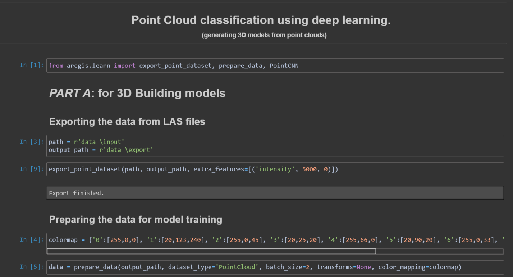
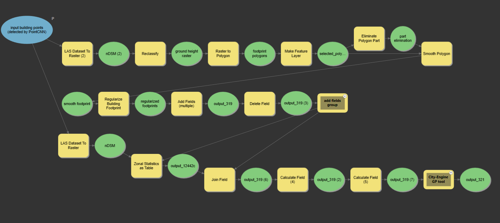
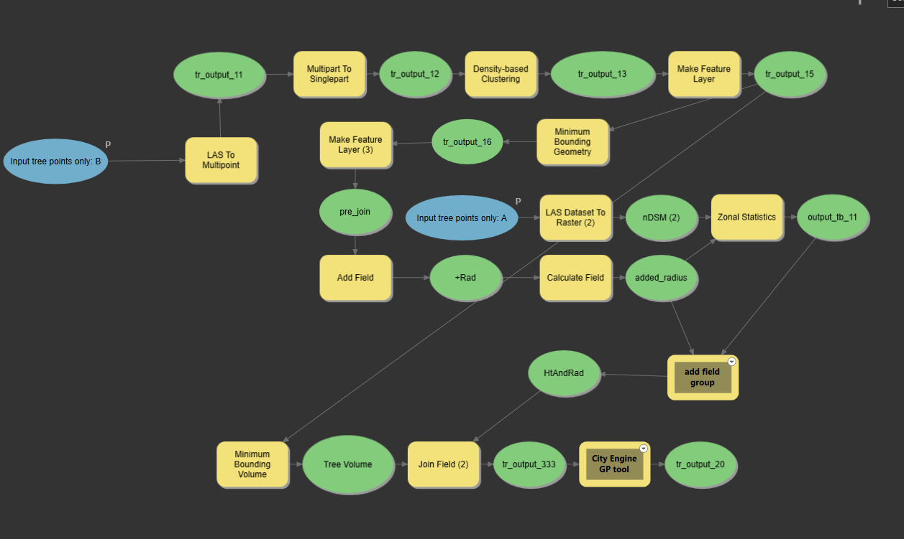
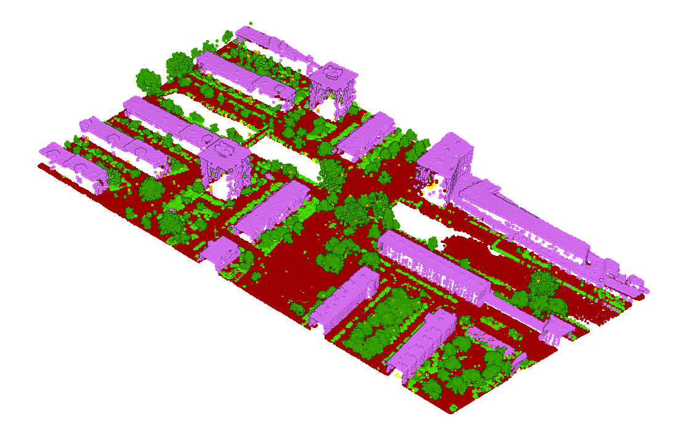
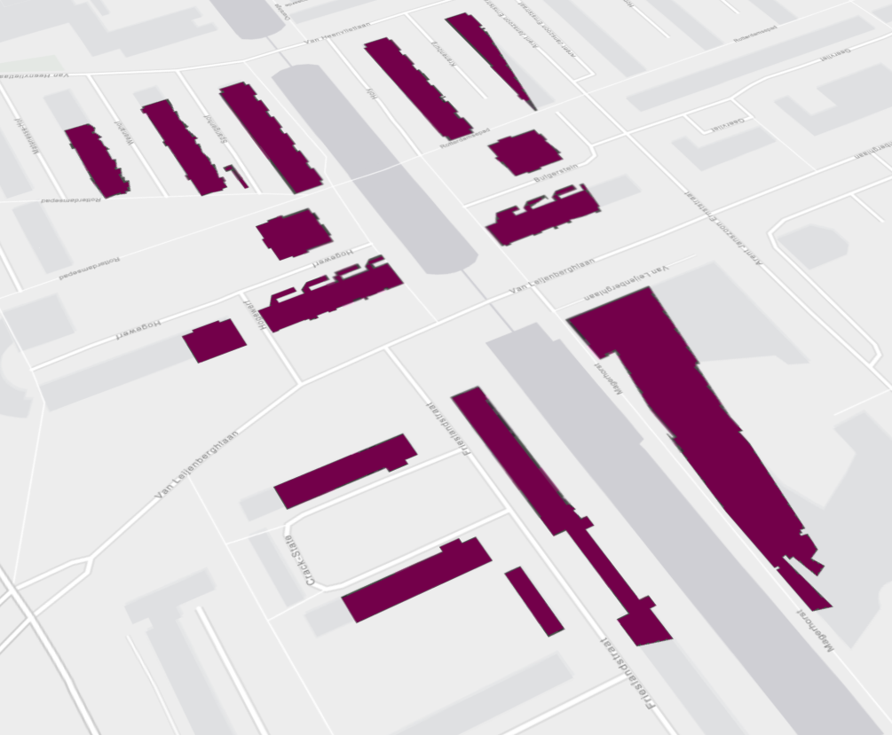
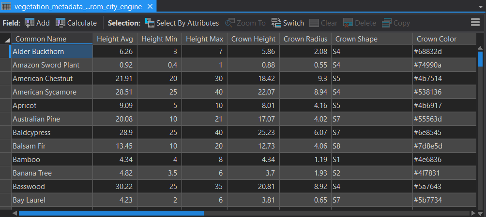
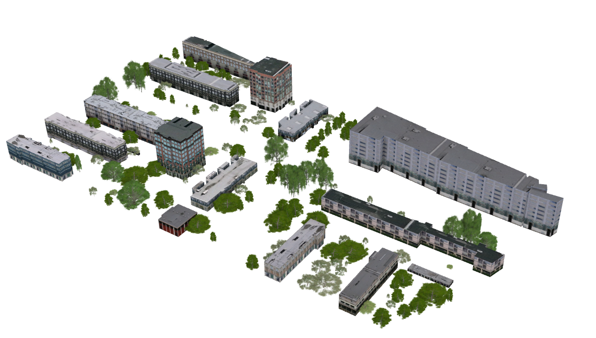

# An end to end 'deep learning' based solution: Generating 3D models from raw LiDAR data.

### Introduction 

This project was presented at the Esri UC 2020 Plenary session. This repository contains the GIS workflow & the code needed for classification of Raw Point Clouds using Deep Learning, which is followed by the generation of 3D Building & Tree Models/Multipatches.

Classification of point clouds has always been a challenging task, due to its naturally unordered data structure. The workflow described in this project is about going from raw unclassified point clouds to digital twins: near-perfect representation of real-world entities. Within the scope of this project, we are only interested in 'digital twins of buildings & trees' (3D models/multipatches), but this work can also be used for guidance, in other relevant use-cases. Similarly, we limit our scope to point clouds generated from airborne LiDAR sensors or SfM-generated point clouds from airborne imagery.

We can further divide this project's workflow, based on what technology or set of tools are used. First, is the 'deep learning' portion of the workflow where 'ArcGIS API for Python' is used, and second is the 'GIS' portion, where features of 'ArcGIS Pro' & 'City Engine' are utilized.

**Note:** Details about the PointCNN's working principle, implementation in API, network architecture, etc. can be found [here](https://developers.arcgis.com/python/guide/point-cloud-segmentation-using-pointcnn), along with the instructions for setting up the python environment. While the API Reference for PointCNN can be found [here](https://developers.arcgis.com/python/api-reference/arcgis.learn.html#pointcnn).

### Objectives

  - Classify building points &  tree points using API's PointCNN Model.
  - Generate multipatches, from classified points using ArcGIS Pro & City Engine.

### Deep Learning workflow

- The workflow starts with preparing the training data for Trees & Buildings, where we use open data from the Netherlands & UK. Then we Reassign class-codes so that only relevant classes remain in the data.

- Then we train a model for 'Building' & 'Background' classes & use `predict_las( )` to classify point clouds in the test area.

- In general, it is harder to train for high vegetation/tree points, as compared to building points, due to lack of good training data, complex nature of tree points, etc. Here, we have trained another model that can classify tree points with very high completeness but low correctness, i.e. it overestimates tree points. "It does the job, but using it will result in increased post-processing effort to remove noise (overestimated points)."

- To tackle this, & reduce our post-processing efforts, we trained another model for 4 classes: Ground, Building, Bridges & Background (Trees, cars, etc.), on the Netherlands ' data. Where we use the feature of `selective_classify( )`. To get the best possible correctness & completeness, using both the models.

Complete deep learning workflow resides in a jupyter notebook, as shown in the figure below (notebook is available in this repo):

 

### GIS workflow

Generation of Building & Tree multipatches have separate workflows.

###### Building Multipatches:

- For building multipatches, we start from PointCNN's classified building points.
- Then using multiple GP tools in ArcGIS Pro, we find the building footprints. And populate its attribute table with information like roof height, type of building, etc.
- Lastly, these footprints are used to generate realistic 3D models/multipatches using City Engine's rule packages (where 'Features From CityEngine Rules' GP tool is used).

There can be multiple unsupervised/semi-supervised workflows to clean the noise & generate building footprints from classified building points, one such method for reference is shown in the 'model builder' diagram below:

 

###### Tree Multipatches:

- For tree multipatches, we start from PointCNN's classified tree points.
- Then using multiple GP tools in ArcGIS Pro, we find the tree footprints. And populate its attribute table with information like tree radius, tree height, etc. Also, here we calculate many other useful tree attributes like crown volume, crown's min. height, crown's max height, area, 3D surface area, etc.
- Lastly, these footprints are used to generate realistic 3D models/multipatches using City Engine's rule packages, while the metadata that comes with City Engine's vegetation CGA assets is also used to get the best possible guess for tree species & it's properties without physically visiting the area of interest.

There can be multiple unsupervised/semi-supervised workflows to clean the noise & generate tree footprints from classified tree points, one such method for reference is shown in the 'model builder' diagram below:

 

### Results

**Visualization of results in notebook:**

**PointCNN’s output for buildings & trees:**

**Identifying individual trees using clustering:** 

 

**Tree footprints:**

 

**Building footprints:**

 

**Tree crown volumes:**

 

**City Engine’s vegetation metadata:**

 

**Final output with tree & building 3D models:**

 
 
